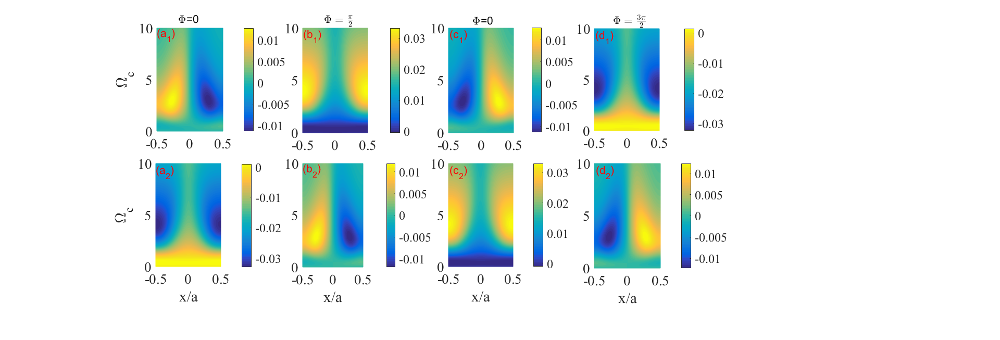
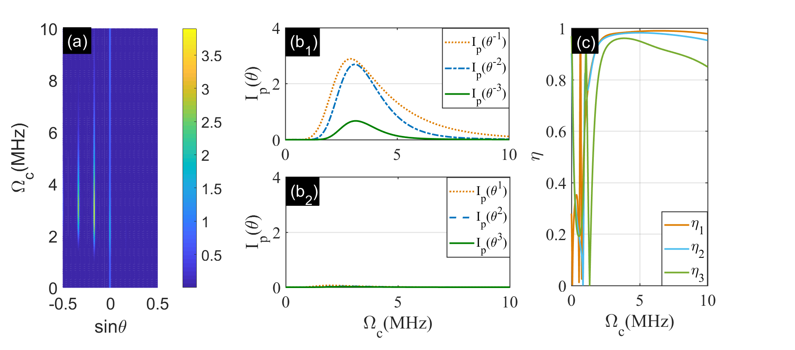

# Nloop_eig
# Numerical Simulation of Non-Hermitian Optical Diffraction


## Overview

This repository archives the numerical implementation and raw research data for the paper:

> **"Lopsided optical diffraction in a loop electromagnetically induced grating"**
> *Optics Express*, Vol. 31, No. 10 (2023).
> [Link to Paper](https://opg.optica.org/oe/fulltext.cfm?uri=oe-31-10-16251&id=530271)

The codebase employs a **hybrid workflow** to model Open Quantum Systems. It combines symbolic derivation (Mathematica) with high-performance visualization (MATLAB).

> **Note on Repository Structure:**
> This repository serves as a permanent archive of the research process. The directory structure reflects the original workflow. Some sub-directories and data files in the visualization module retain their original working names (in Chinese) to preserve the integrity of the raw data.

## Directory Structure

### 1. Physics Engine (`Main_Simulation/`)
This directory contains the **Wolfram Mathematica** source code (`.nb`), covering both exact numerical solutions and analytical approximations.

* **`Main_Simulation.nb`**: **(Full Numerical Solution)**
    Exact calculation of the density matrix equations without approximations. It solves the full linear system to obtain the steady-state susceptibility.
* **`Order_Calculations.nb`**: **(Stepwise Orders)**
    Computes the contribution of individual scattering orders to analyze the diffraction mechanisms.
* **`Weak_Field_Analytical.nb`**: **(Analytical Derivation)**
    Derives the analytical solutions of the system under the **weak-field approximation**, serving as a benchmark for the numerical results.

### 2. Visualization Pipeline (`program/`)
This directory contains **MATLAB** scripts and the full dataset of simulation results.

* **Function**: Reads data exported from Mathematica and performs Fourier optics integration.
* **Key Scripts**:
    * `Nloop_phase_asymmetry.m`: Analyzes diffraction intensity and asymmetry coefficients (corresponding to Fig. 6).
    * `Nloop_eit_num_phase.m`: Calculates EIT (Electromagnetically Induced Transparency) spectra.
* **Data Archive**:
    * Sub-folders (e.g., `Diffraction`, `Oc_2D`) contain raw simulation outputs and generated figures used in the analysis.

## Key Results

The code reproduces the following physical phenomena reported in the paper:

| **PT-Symmetry Phase Transition (Fig 3)** | **Diffraction Asymmetry (Fig 6)** |
| :---: | :---: |
|  |  |
| *Modulation of absorption/gain ($Im[\chi]$).* | *Asymmetric diffraction intensity and coefficient $\eta$.* |


## Citation

```bibtex
@article{huo2023lopsided,
  title={Lopsided optical diffraction in a loop electromagnetically induced grating},
  author={Huo, Da, et al.},
  journal={Optics Express},
  volume={31},
  number={10},
  pages={16251--16264},
  year={2023}
}
